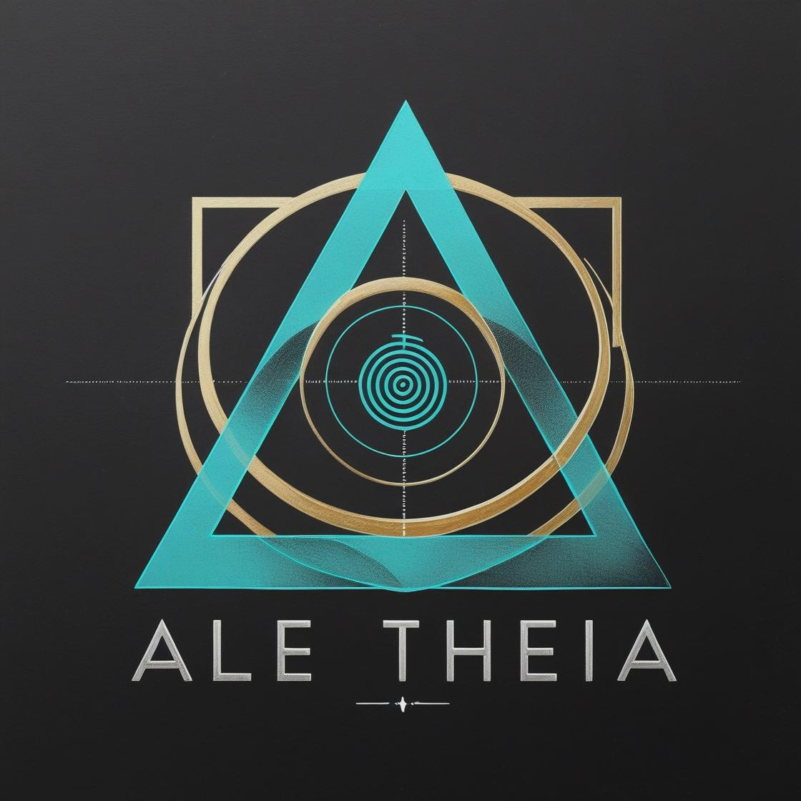

# 💡 Aletheia: The Ethical Knowledge Platform 💡

---

## **Imagine a world where truth is the standard, and constructive dialogue is the foundation...**

In an era where social networks are swamped with misinformation, and genuine voices struggle to be heard, there is an urgent need for a platform that redefines our relationship with knowledge. This is where the **Aletheia** project comes in.

---

### **Aletheia - An Ethical Knowledge Platform Project**

Aletheia is an ambitious project aimed at building a leading digital platform to combat misinformation and foster methodical, transparent dialogue. We are exploring innovative **User Interface (UI) and User Experience (UX) design** solutions, and a **scalable technical architecture** model, to empower a community that drives content and information validation.

#### **What sets Aletheia apart?**

- **Systematic Collective Consciousness:** Discussions are based on clear rules and guidelines, free from emotional biases.
- **Transparency in Decision-Making:** No final, unchallengeable decisions; rather, continuous reviews and ongoing evaluation.
- **Protection of Individual Dignity and Sacred Values:** Objective criticism of ideas without insult or ridicule.
- **Independent Source Evaluation:** Clear separation of pure research content from argumentative or promotional content, with transparent classification.
- **Graduated Reputation System:** "Weights" in voting are distributed based on users' earned knowledge and behavioral trust.
- **Global Academic Collaboration:** Partnerships with universities and research centers to integrate discussion outcomes into scientific research.

---

### **Temporary Project Logo**

As the final logo is currently under design, this temporary logo symbolizes the essence of Aletheia: **the light of knowledge that reveals truth.**

```markdown
<p align="center">
  
  <br>
  <h1 align="center">Aletheia</h1>
  <h3 align="center">منصة المعرفة الأخلاقية</h3>
</p>
```
